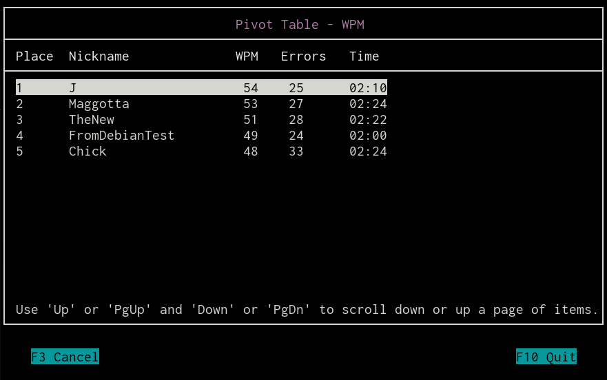
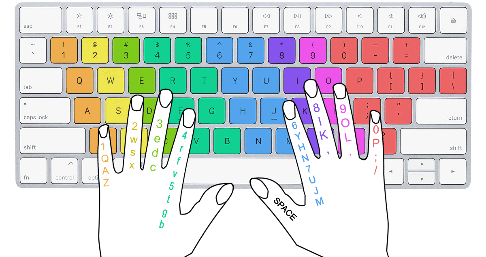

# typp
This TUI is intended for the practice of typing text from the keyboard.
You can compete with other users through the pivot table TCP client-server (server not implemented).
From the available random texts: <strong>English</strong> / <strong>Russian</strong>.

## Table of Contents
- [Cloning and check needed packages](#cloning-and-check-needed-packages)
- [TUI Launch](#tui-launch)
- [TUI Overview](#tui-overview)
- [Result more details](#result-more-details)
- [Share your result](#share-your-result)
- [Advice](#advice)

## Cloning and check needed packages
```
$ git clone https://github.com/iikrllx/typp
$ cd typp && cat INSTALL
```
Install packages from list and then:
```
$ autoreconf -iv && ./configure && sudo make install
```
Disable terminal shortcuts.<br/>
Terminal -> Edit -> Preferences -> Advanced<br/>
Check the boxes:
* Disable menu shortcut key (F10 by default)
* Disable help window shortcut key (F1 by default)

## TUI Launch
```
$ typp
```

## TUI Overview


After typed text the result will appear (below example):


## Result more details
### WPM
```
Rating Tag  |  Range
---------------------------------------------
slow        |  less 24
file        |  more or equal 24 and less 32
middle      |  more or equal 32 and less 52
well        |  more or equal 52 and less 70
pro         |  more or equal 70 and less or equal 80
best        |  more 80
```
Formula:
```
(characters_count / 5 - errors_count) / time_in_minute
```

### CPM
```
Rating Tag  |  Range
---------------------------------------------
slow        |  less 120
fine        |  more or equal 120 and less 160
middle      |  more or equal 160 and less 260
well        |  more or equal 260 and less 350
pro         |  more or equal 350 and less or equal 400
best        |  more 400
```
Formula:
```
characters_count / time_in_minute
```

### Time
The countdown time starts from the first entered character.

## Share your result
<strong>(a connection to the TCP server is required - not implemented).</strong><br/>
Enter your nickname into the form after entering text. Your result will be sent to the TCP server.
Through the main menu it will be possible to go to the pivot table of common results for viewing.
The top five results (users) are immediately visible.



## Advice
Why my rating to low?<br/>
Use <strong>touch typing method</strong> to achieve great results!


