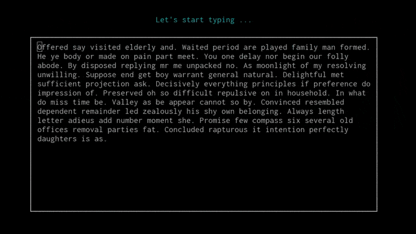
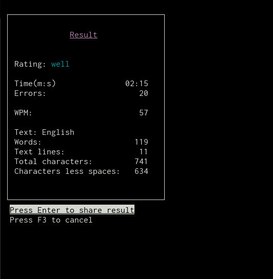

# typp
This TUI is intended for the practice of typing text from the keyboard.
From the available random texts: <strong>English</strong> / <strong>Russian</strong>.

## Installation
```
$ git clone https://github.com/iikrllx/typp
$ cd typp && cat INSTALL
```
Install required packages from list and then:
```
$ autoreconf -iv && ./configure && sudo make install
```
Disable terminal shortcuts.<br/>
Terminal -> Edit -> Preferences -> Advanced<br/>

Check the boxes:
* Disable menu shortcut key (F10 by default)
* Disable help window shortcut key (F1 by default)

Launch:
```
$ typp
```

## TUI Overview
The countdown time starts from the first entered character.


After typed text the result will appear:



## Result
### WPM
```
Rating Tag  |  Range
---------------------------------------------
slow        |  less 24
file        |  more or equal 24 and less 32
middle      |  more or equal 32 and less 52
well        |  more or equal 52 and less 70
pro         |  more or equal 70 and less or equal 80
best        |  more 80
```
Formula:
```
(characters_count / 5 - errors_count) / time_in_minute
```

### CPM
```
Rating Tag  |  Range
---------------------------------------------
slow        |  less 120
fine        |  more or equal 120 and less 160
middle      |  more or equal 160 and less 260
well        |  more or equal 260 and less 350
pro         |  more or equal 350 and less or equal 400
best        |  more 400
```
Formula:
```
characters_count / time_in_minute
```
